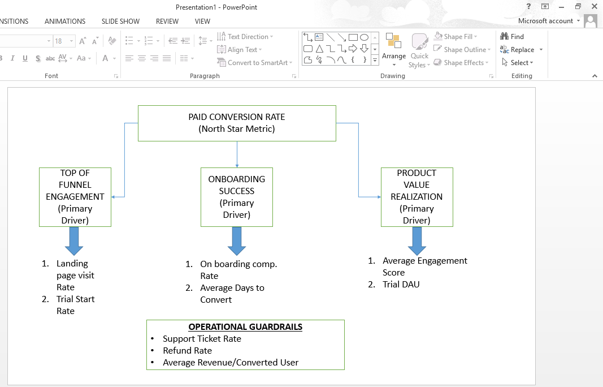

Business Problem Statement
1. What decision needs to be made?
Leadership to decide whether the new onboarding and activation campaign (the treatment group) should be launched to all users, or if the company should stick with the existing onboarding experience (the control group).

2. Who the decision impacts?
This decision directly impacts new users who will go through the onboarding process. It also impacts the customer support team, who will have to handle any confusion caused by the new flow, and the business leadership team, whose revenue goals depend on successful user conversions.

3. What metric should improve?
Since the campaign's objective is to improve user conversion and early engagement, the primary metric that needs to improve is the Paid Conversion Rate (the percentage of users who successfully convert from a trial or free state to a paid plan).

4. What risks must be monitored?
Optimizing just for conversion can cause issues elsewhere. We must actively monitor Guardrail Metrics such as the Refund Rate (to check if users feel tricked into paying) and the Support Ticket Rate (to ensure the new onboarding isn't frustrating or confusing).

5. What evidence is required before making a recommendation?
Before recommending a launch, I need to see a statistically significant increase in the Paid Conversion Rate backed by an A/B test. I also need to verify that our guardrail metrics (like support tickets and refunds) have not spiked, ensuring the growth is sustainable.

North Star Metric
Selected Metric: Paid Conversion Rate

Why this metric is the main success metric:

The primary objective of the new onboarding campaign is to improve user conversion. The Paid Conversion Rate directly measures the ultimate success of this objective—how effectively we are turning free/trial users into paying subscribers.

Why other metrics are supporting metrics instead of the North Star:

Metrics like "Landing page visit rate" or "Onboarding completion rate" are leading indicators. They are necessary steps in the user journey and help diagnose where users drop off, but they do not independently represent final business value. A user completing onboarding but never paying doesn't help the bottom line.

How this metric connects to business growth:

In a subscription-based model, increasing the percentage of users who convert to a paid tier directly drives Monthly Recurring Revenue (MRR) and expands the active customer base, fueling sustainable business growth.

What could go wrong if this metric is optimized blindly:

If we optimize solely for conversions without monitoring user satisfaction, we risk using deceptive tactics (dark patterns) or aggressive push notifications. This could lead to a severe spike in refund requests, a flooded customer support queue, and long-term damage to the brand's reputation and retention rates.

Experiment Data Preparation & Cleaning
Before analyzing the experiment results, the dataset "campaign_experiment_data.xlsx" underwent a rigorous data quality audit:

Duplicate User IDs: Identified multiple duplicate User IDs. These were resolved by keeping the first instance and removing the exact duplicate rows to prevent double-counting.

Missing Values: Discovered blank records in device_type and traffic_source, which were filled with the label "Unknown" to maintain segment integrity. Blanks in engagement_score and days_to_convert were intentionally left as nulls; days_to_convert is naturally null for non-converting users, and leaving them blank ensures our average calculations remain mathematically accurate.

Invalid Binary Values: Verified that funnel metrics (visited_landing_page, started_trial, completed_onboarding, converted_to_paid) contained only valid 1 and 0 boolean values.

Outliers in Revenue: Identified extreme, unrealistic revenue outliers, values exceeding $3,000. These specific rows were removed from the dataset to prevent skewed Average Revenue Per User (ARPU) calculations.

Group Counts & Segment Distribution: Verified the A/B test split was adequately balanced (Control: ~49%, Treatment: ~51%) with standard distribution across regions and device types.

Guardrail Metrics Performance Evaluation

While the new onboarding campaign successfully accelerated top-line conversions, we must carefully review our operational guardrail metrics to assess long-term business risk: 

Support Ticket Rate Spike: Our support ticket rate significantly increased from 22.13% in the Control group to 37.32% in the Treatment group. This severe 15.19% absolute surge indicates that the new onboarding campaign introduces significant user confusion, onboarding friction, or onboarding technical issues that are overwhelming our customer support team.

Refund Requests Emerged: The Control group maintained a perfect 0.00% refund rate, whereas a 0.42% refund rate emerged in the Treatment group. While 0.42% is structurally low, any post-conversion refund requests point to immediate buyer's remorse, suggesting the new flow might be overly aggressive or misleading.

Average Revenue Per Converted User Devaluation: Interestingly, our average revenue per converted user dropped from $872.48 to $770.36. This indicates that the new campaign forces a higher volume of conversions by potentially relying heavily on introductory tier plans or steep promotional discounts, reducing the premium value per subscriber.

Risk Assessment Summary: Launching this onboarding sequence to 100% of our user base blindly creates immediate operational bottlenecks for customer support and threatens customer retention through early cancellations and refund loops. 

---

## Dataset Description
The analysis was performed using a randomized experiment dataset (`campaign_experiment_data.xlsx`) consisting of 1,400 unique user interaction logs. The dataset tracks user behavior across a standard digital product activation funnel, detailing signup variables, onboarding progress states, downstream operational support logs, and 30-day post-activation subscription revenues.

---

## KPI Tree Structure Summary
To evaluate the experiment's impact systematically, a KPI tree was framed anchoring our North Star Metric to operational drivers:
* **North Star Metric:** Paid Conversion Rate
* **Primary Growth Drivers:** * Top of Funnel Engagement (Landing Page Visit Rate, Trial Start Rate)
  * Onboarding Success (Onboarding Completion Rate, Average Days to Convert)
  * Product Value Realization (Average Engagement Score, Trial DAU)
* **Operational Guardrails:** Support Ticket Rate, Refund Rate, Average Revenue Per Converted User

---

## Verification & Screenshots Preview
Below is the embedded verification evidence detailing the experimental analytics, statistical test execution, and structural metrics frameworks required for evaluation:

### 1. Main Experiment Summary Metrics

### 2. Hypothesis Test Output & Mathematical Evidence

### 3. Visual KPI Tree Architecture
